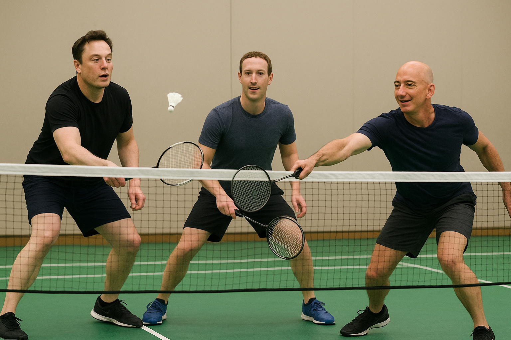

# A2A Badminton Scheduling Project

<div align="center">
  
</div>


A multi-agent system demonstrating Agent-to-Agent (A2A) communication using Google's A2A SDK. The project simulates a real-world scenario where multiple AI agents coordinate to schedule badminton games.

## 🎯 Project Goal

This project demonstrates **Agent-to-Agent (A2A) communication** where AI agents can:
- Communicate with each other autonomously
- Coordinate tasks across multiple agents
- Share information and make collaborative decisions
- Use tools to check availability and book resources

### Real-World Scenario

**Elon Agent** (Host/Coordinator) wants to organize a badminton game. It needs to:
1. Ask **Jeff Agent** and **Mark Agent** about their availability
2. Find a common time slot when both are free
3. Check court availability using tools
4. Book a badminton court for the agreed time

This mimics how human assistants would coordinate - each agent has its own information (calendars, tools) and they communicate to reach a common goal.

---

## 🏗️ Architecture

### Agent Overview

| Agent | Framework | Role | Port | Tools |
|-------|-----------|------|------|-------|
| **Elon Agent** | Google ADK | Host/Coordinator - Orchestrates scheduling | 8000 (ADK Web UI) | `send_message`, `book_badminton_court`, `list_court_availabilities` |
| **Jeff Agent** | LangChain + LangGraph | Jeff's Scheduling Assistant | 10004 | `get_availability` (checks Jeff's calendar) |
| **Mark Agent** | CrewAI | Mark's Scheduling Assistant | 10005 | `AvailabilityTool` (checks Mark's calendar) |

### Technology Stack

- **A2A SDK**: Agent-to-Agent communication protocol
- **Google ADK**: Agent Development Kit for building conversational agents
- **LangChain/LangGraph**: Framework for building LLM applications with memory
- **CrewAI**: Multi-agent orchestration framework
- **Google Gemini**: LLM for agent reasoning
- **UV**: Fast Python package manager

---

## 📋 Prerequisites

- Python 3.11+
- UV package manager ([Installation guide](https://docs.astral.sh/uv/))
- Google API Key (for Gemini models)

---

## 🚀 Setup Instructions

### 1. Configure Environment Variables

Create a `.env` file in the project root:

```bash
# .env
GOOGLE_API_KEY=your_google_api_key_here
```

> **Get your Google API Key**: Visit [Google AI Studio](https://aistudio.google.com/app/apikey)

### 2. Install Dependencies

Each agent has its own `pyproject.toml`. Install dependencies per agent:

```bash
cd elon_agent
uv sync

cd ../jeff_agent
uv sync

cd ../mark_agent
uv sync
```

---

## 🎮 Running the Agents

### Jeff Agent (Port 10004)

Jeff's scheduling assistant runs as an A2A server using LangChain.

```bash
cd jeff_agent
uv run python __main__.py
```

**Expected Output:**
```
Starting Jeff Agent A2A Server...
Agent card available at: http://localhost:10004/.well-known/agent-card.json
Server running on http://localhost:10004
```

**Test the agent:**
```bash
curl http://localhost:10004/.well-known/agent-card.json
```

---

### Mark Agent (Port 10005)

Mark's scheduling assistant runs as an A2A server using CrewAI.

```bash
cd mark_agent
uv run python __main__.py
```

**Expected Output:**
```
Starting Mark Agent A2A Server...
Agent card available at: http://localhost:10005/.well-known/agent-card.json
Server running on http://localhost:10005
```

**Test the agent:**
```bash
curl http://localhost:10005/.well-known/agent-card.json
```

---

### Elon Agent (ADK Web UI)

The host coordinator agent runs via Google ADK with a web interface.

```bash
cd elon_agent
uv run adk web
```

**Expected Output:**
```
ADK Web Server started
For local testing, access at http://127.0.0.1:8000
```

**Access the UI:**
Open your browser and navigate to:
```
http://127.0.0.1:8000
```

---

## 🧪 Testing the Complete System

### Step 1: Verify All Agents are Running

Check that all three agents are responding:

```bash
# Jeff Agent
curl http://localhost:10004/.well-known/agent-card.json

# Mark Agent
curl http://localhost:10005/.well-known/agent-card.json

# Elon Agent (ADK)
curl http://127.0.0.1:8000/list-apps
```

### Step 2: Test via ADK Web UI

1. Open browser to `http://127.0.0.1:8000`
2. Select `elon` agent from the dropdown
3. Start a conversation:

**Example Queries:**

```
"Hi, can you help me organize a badminton game with Jeff and Mark?"

"Check if Jeff is available on March 14th, 2026"

"Ask Mark about his availability for next week"

"Find a common time when both Jeff and Mark are free"

"Check court availability for March 15th at 9:00 AM"

"Book a court for us at that time"
```

### Step 3: Observe Agent-to-Agent Communication

Watch the terminal logs to see:
- **Elon Agent**: Sending messages to Jeff and Mark
- **Jeff Agent**: Processing availability requests
- **Mark Agent**: Checking calendar and responding
- **Elon Agent**: Aggregating responses and making decisions

---

## 📁 Project Structure

```
a2a-project/
├── .env                          # Environment variables (GOOGLE_API_KEY)
├── README.md                     # This file
├── a2a-project.excalidraw         # Architecture diagram (editable)
├── goal.png                      # Diagram image
│
├── elon_agent/                   # Host coordinator agent (Google ADK)
│   ├── .python-version            # Python version specification
│   ├── pyproject.toml             # Dependencies (per agent)
│   └── elon/
│       ├── agent.py               # Main agent logic with A2A client
│       └── tools.py               # Court booking tools
│
├── jeff_agent/                   # Jeff's scheduling agent (LangChain)
│   ├── .python-version            # Python version specification
│   ├── __main__.py                # A2A server entry point
│   ├── agent.py                   # LangChain agent with memory
│   ├── agent_executor.py          # A2A executor wrapper
│   ├── pyproject.toml             # Dependencies (per agent)
│   ├── tools.py                   # Availability checking tool
│   └── uv.lock                    # Dependency lock file
│
└── mark_agent/                   # Mark's scheduling agent (CrewAI)
    ├── .python-version            # Python version specification
    ├── __main__.py                # A2A server entry point
    ├── agent.py                   # CrewAI agent
    ├── agent_executor.py          # A2A executor wrapper
    ├── pyproject.toml             # Dependencies (per agent)
    ├── tools.py                   # Availability tool
    └── uv.lock                    # Dependency lock file
```

---

## 🔧 How It Works

### 1. Agent Communication Flow

```
User → Elon Agent (ADK)
         ↓
    [Send Message via A2A]
         ↓
    ┌────┴────┐
    ↓         ↓
Jeff Agent  Mark Agent
    ↓         ↓
[Check Calendar]
    ↓         ↓
[Return Availability]
    ↓         ↓
    └────┬────┘
         ↓
    Elon Agent
         ↓
[Find Common Time]
         ↓
[Check Court Availability]
         ↓
[Book Court]
         ↓
    User ← Response
```

### 2. A2A Protocol

Each agent exposes:
- **Agent Card** (`.well-known/agent-card.json`): Metadata about the agent
- **Message Endpoint**: Accepts A2A-formatted messages
- **Response Format**: Returns structured responses

### 3. Tools & Capabilities

**Jeff Agent Tools:**
- `get_availability(date)`: Checks Jeff's calendar for the given date

**Mark Agent Tools:**
- `AvailabilityTool`: Checks Mark's calendar (CrewAI tool format)

**Elon Agent Tools:**
- `send_message(agent_name, task)`: Sends A2A messages to other agents
- `list_court_availabilities(date)`: Lists available court time slots
- `book_badminton_court(date, start_time, end_time, name)`: Books a court

---

## 🐛 Troubleshooting

### Common Issues

#### 1. Import Error: `No module named 'a2a'`

**Solution:** Make sure you're running from the correct directory with `uv run`:
```bash
cd jeff_agent  # or mark_agent
uv run python __main__.py
```

#### 2. Agent Not Found Error in ADK

**Solution:** Ensure the ADK entry module defines `root_agent`:
```bash
cd elon_agent/elon
# Check that agent.py sets a module-level `root_agent` (created from setup()).
```

#### 3. Port Already in Use

**Solution:** Kill existing processes:
```bash
lsof -ti:10004 | xargs kill -9  # Jeff Agent
lsof -ti:10005 | xargs kill -9  # Mark Agent
lsof -ti:8000 | xargs kill -9   # Elon Agent
```

#### 4. GOOGLE_API_KEY Not Found

**Solution:** Ensure `.env` file exists in project root:
```bash
echo "GOOGLE_API_KEY=your_key_here" > .env
```

#### 5. LLM Returns None/Empty

**Solution:** Check API key and model name:
```python
# For CrewAI (Mark Agent)
model="gemini/gemini-2.5-flash"

# For LangChain (Jeff Agent)
model="gemini-2.5-flash"
```

---

## 📚 Key Concepts

### Agent-to-Agent (A2A) Communication

- **Decentralized**: Each agent runs independently
- **Protocol-based**: Standard message format for interoperability
- **Asynchronous**: Agents can handle multiple requests concurrently
- **Tool-augmented**: Agents can use tools to access external data

### Why Multiple Frameworks?

This project intentionally uses different frameworks to demonstrate:
- **Interoperability**: A2A works across different agent implementations
- **Framework Comparison**: See how LangChain, CrewAI, and ADK differ
- **Real-world Flexibility**: Organizations may have agents built with different tools

---

## 🎓 Learning Resources

- [Google ADK Documentation](https://ai.google.dev/adk)
- [A2A SDK Documentation](https://github.com/google/a2a-sdk)
- [LangChain Documentation](https://python.langchain.com/)
- [CrewAI Documentation](https://docs.crewai.com/)
- [UV Package Manager](https://docs.astral.sh/uv/)

---

## 🤝 Contributing

This is a learning project. Feel free to:
- Add new agents
- Implement additional tools
- Improve error handling
- Add tests
- Enhance documentation

---

## 📄 License

This project is for educational purposes.

---

## 🙏 Acknowledgments

- Google AI for ADK and Gemini models
- A2A SDK team for the agent communication protocol
- LangChain and CrewAI communities for excellent frameworks

---

**Happy Agent Building! 🤖🏸**
